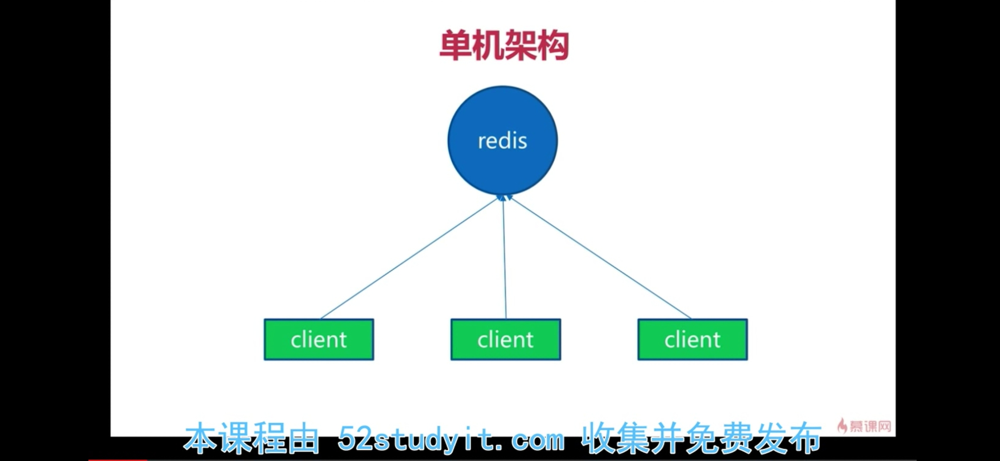
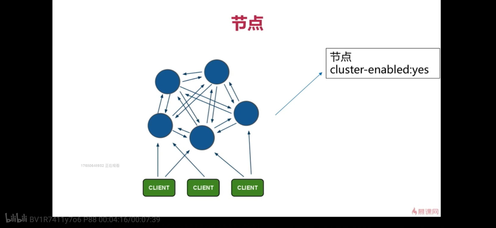
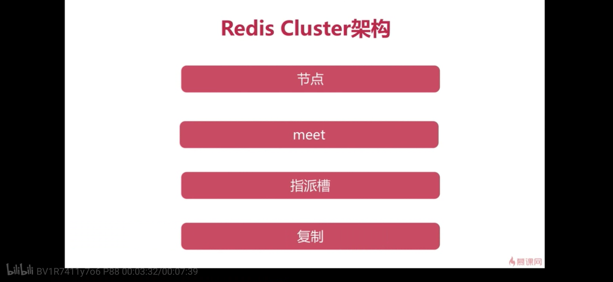

# redis集群cluster

## 1. 为什么需要redis cluster

之前介绍的两种redis工作模式，其实都属于单机的redis，即只有单个节点存储所有的数据，这种情况有以下几个问题

1.  **单机容量瓶颈**
2.  **单机网络瓶颈**
3.  **单机吞吐量瓶颈**(读写分离能解决一部分)

因此redis官方推出了分布式的redis集群模式，该模式主要解决上述问题。在redis集群模式下，可以将数据分散在多个redis节点上，在业务发展过程中，可以随时进行水平扩容和缩容。

## 2. redis集群架构

###2.1 redis单机架构

###2.2 redis cluster架构



## 3. redis集群搭建

下面将以3个redis节点的集群：(3个节点，每个节点一个副本)来搭建实验环境，规定7000、7001、7002为主节点，7003、7004、7005依次为上述节点的副本节点。

###3.1 redis 集群安装步骤


###3.2 redis cluster指派哈希槽


###3.3 redis cluster配置文件

```shell
# 开启集群模式
cluster-enabled yes
# 指定集群的配置文件
cluster-config-file nodes-7000.conf
# 指定集群节点超时时间
cluster-node-timeout 15000
# 是否要求集群所有节点都可用时，才能对外提供服务，一般设置no
cluster-require-full-coverage yes
bind 127.0.0.1
protected-mode yes
port 7000
tcp-backlog 511
timeout 0
tcp-keepalive 300
daemonize yes
supervised no
pidfile ../data/7000.pid
loglevel notice
logfile "../data/7000.log"
databases 16
always-show-logo yes
save 900 1
save 300 10
save 60 10000
stop-writes-on-bgsave-error yes
rdbcompression yes
rdbchecksum yes
dbfilename dump-7000.rdb
rdb-del-sync-files no
dir ../data/
```

###3.4 redis cluster启动

####3.4.1 启动redis cluster server 

```shell
➜  ~/learn-redis/bin ./redis-server ../config/redis-7000.conf
➜  ~/learn-redis/bin ./redis-server ../config/redis-7001.conf
➜  ~/learn-redis/bin ./redis-server ../config/redis-7002.conf
➜  ~/learn-redis/bin ./redis-server ../config/redis-7003.conf
➜  ~/learn-redis/bin ./redis-server ../config/redis-7004.conf
➜  ~/learn-redis/bin ./redis-server ../config/redis-7005.conf
➜  ~/learn-redis/bin


查看 server 信息
➜  ~/learn-redis/bin ./redis-cli -p 7000
127.0.0.1:7000> cluster nodes
27aca9f02341a086489555e1c7551eaf16c59941 127.0.0.1:7000@17000 myself,master - 0 0 0 connected
127.0.0.1:7000> cluster info
cluster_state:fail
cluster_slots_assigned:0
cluster_slots_ok:0
cluster_slots_pfail:0
cluster_slots_fail:0
cluster_known_nodes:1
cluster_size:0
cluster_current_epoch:0
cluster_my_epoch:0
cluster_stats_messages_pong_sent:5
cluster_stats_messages_sent:5
cluster_stats_messages_ping_received:5
cluster_stats_messages_received:5
127.0.0.1:7000>


```

####3.4.2 redis cluster server meet
```shell
➜  ~/learn-redis/bin ./redis-cli -p 7000 cluster meet 127.0.0.1 7001
OK
➜  ~/learn-redis/bin ./redis-cli -p 7000 cluster meet 127.0.0.1 7002
OK
➜  ~/learn-redis/bin ./redis-cli -p 7000 cluster meet 127.0.0.1 7003
OK
➜  ~/learn-redis/bin ./redis-cli -p 7000 cluster meet 127.0.0.1 7004
OK
➜  ~/learn-redis/bin ./redis-cli -p 7000 cluster meet 127.0.0.1 7005
OK
➜  ~/learn-redis/bin

查看redis cluster 节点信息

➜  ~/learn-redis/bin ./redis-cli -p 7000
127.0.0.1:7000> cluster nodes
3058f3e387092112b34665fd3bad42ae5a55b4c6 127.0.0.1:7003@17003 slave 8d789ab01ca40f1d1093ab50bc584e4a1f77b092 0 1595749458997 4 connected
bb204343edf8534fcaf4f14ed432e4c1d43b0ccc 127.0.0.1:7001@17001 master - 0 1595749457000 5 connected
0064977144179a480d820bf258df4cbf5a22f7b8 127.0.0.1:7002@17002 master - 0 1595749460004 3 connected
c00b1bef78c851bf9ecf58d7ce276a1f7cce5e74 127.0.0.1:7005@17005 slave bb204343edf8534fcaf4f14ed432e4c1d43b0ccc 0 1595749457989 5 connected
27aca9f02341a086489555e1c7551eaf16c59941 127.0.0.1:7000@17000 myself,master - 0 1595749455000 0 connected
8d789ab01ca40f1d1093ab50bc584e4a1f77b092 127.0.0.1:7004@17004 slave - 0 1595749458000 2 connected
127.0.0.1:7000>

```

####3.4.3 redis cluster server replicate

```shell
设置副本
cluster replicate nodeid
7003->7000
➜  ~/learn-redis/bin ./redis-cli -p 7003
127.0.0.1:7003> CLUSTER REPLICATE 127.0.0.1 27aca9f02341a086489555e1c7551eaf16c59941
(error) ERR Unknown subcommand or wrong number of arguments for 'REPLICATE'. Try CLUSTER HELP.
127.0.0.1:7003> CLUSTER REPLICATE  27aca9f02341a086489555e1c7551eaf16c59941
OK
127.0.0.1:7003> exit

7004->7001
➜  ~/learn-redis/bin ./redis-cli  -p 7004
127.0.0.1:7004> cluster replicate bb204343edf8534fcaf4f14ed432e4c1d43b0ccc
OK
127.0.0.1:7004> exit

7005->7002
➜  ~/learn-redis/bin ./redis-cli -p 7005
127.0.0.1:7005> cluster replicate 0064977144179a480d820bf258df4cbf5a22f7b8
OK
127.0.0.1:7005>


查看主从关系

127.0.0.1:7000> cluster nodes
3058f3e387092112b34665fd3bad42ae5a55b4c6 127.0.0.1:7003@17003 slave 27aca9f02341a086489555e1c7551eaf16c59941 0 1595749686773 4 connected
bb204343edf8534fcaf4f14ed432e4c1d43b0ccc 127.0.0.1:7001@17001 master - 0 1595749684754 5 connected
0064977144179a480d820bf258df4cbf5a22f7b8 127.0.0.1:7002@17002 master - 0 1595749685765 3 connected
c00b1bef78c851bf9ecf58d7ce276a1f7cce5e74 127.0.0.1:7005@17005 slave 0064977144179a480d820bf258df4cbf5a22f7b8 0 1595749686000 5 connected
27aca9f02341a086489555e1c7551eaf16c59941 127.0.0.1:7000@17000 myself,master - 0 1595749684000 0 connected
8d789ab01ca40f1d1093ab50bc584e4a1f77b092 127.0.0.1:7004@17004 slave bb204343edf8534fcaf4f14ed432e4c1d43b0ccc 0 1595749685000 5 connected
127.0.0.1:7000>


```

####3.4.4 redis cluster server set slots

```shell

➜  ~/learn-redis/bin  ./add_slots.sh 7000 0 5461
OK
➜  ~/learn-redis/bin  ./add_slots.sh 7001 5462 10922
OK
➜  ~/learn-redis/bin  ./add_slots.sh 7002 10923 16383
OK
➜  ~/learn-redis/bin
```

**add_slots.sh**

```shell
#!/bin/bash
port=$1
start=$2
end=$3
./redis-cli -h 127.0.0.1 -p ${port} cluster addslots `seq $start $end`
```


**查看集群的hash槽分配**

```shell
➜  ~/learn-redis/bin ./redis-cli -p 7000 cluster slots
1) 1) (integer) 10923
   2) (integer) 16383
   3) 1) "127.0.0.1"
      2) (integer) 7002
      3) "e5cd4796dfeed63ae7776759c34a1a0ba890e283"
   4) 1) "127.0.0.1"
      2) (integer) 7005
      3) "a10dc1e3b14162698c0f683ff126a33ef443def2"
2) 1) (integer) 5462
   2) (integer) 10922
   3) 1) "127.0.0.1"
      2) (integer) 7001
      3) "cba1eb50530dc4931a25d53a99609a73000167bf"
   4) 1) "127.0.0.1"
      2) (integer) 7004
      3) "5e7dafe306ac6a1eb7a2c4b39b138775b1a2c4d9"
3) 1) (integer) 0
   2) (integer) 5461
   3) 1) "127.0.0.1"
      2) (integer) 7000
      3) "c5c2dcdb29aac2790a3e2fb900f43c65e87e25de"
   4) 1) "127.0.0.1"
      2) (integer) 7003
      3) "f89746c8886c2c673d76e435e8aaa77eee1af85e"
➜  ~/learn-redis/bin

```

## 4. 通过官方工具搭建集群

**通过redis-cli --cluster help查看帮助手册**

```shell
➜  ~/learn-redis/bin ./redis-cli --cluster create 127.0.0.1:8000\
 127.0.0.1:8001 127.0.0.1:8002 127.0.0.1:8003 127.0.0.1:8004 127.0.0.1:8005 --cluster-replicas 1
>>> Performing hash slots allocation on 6 nodes...
Master[0] -> Slots 0 - 5460
Master[1] -> Slots 5461 - 10922
Master[2] -> Slots 10923 - 16383
Adding replica 127.0.0.1:8004 to 127.0.0.1:8000
Adding replica 127.0.0.1:8005 to 127.0.0.1:8001
Adding replica 127.0.0.1:8003 to 127.0.0.1:8002
>>> Trying to optimize slaves allocation for anti-affinity
[WARNING] Some slaves are in the same host as their master
M: c732f89c7f380b9fdb6cbf30dca3370d96cb89f6 127.0.0.1:8000
   slots:[0-5460] (5461 slots) master
M: f9ef5a698f81aa9042442ee9cc66ec1221bc5e85 127.0.0.1:8001
   slots:[5461-10922] (5462 slots) master
M: 9a68a9f9f3b436466a123f36f9d6673b5ed9627e 127.0.0.1:8002
   slots:[10923-16383] (5461 slots) master
S: e0e23fc55ce916c207bd2ace6fb27d333db59e32 127.0.0.1:8003
   replicates 9a68a9f9f3b436466a123f36f9d6673b5ed9627e
S: c2c85370985f43371d9c7c45997b8a72ad4c25f1 127.0.0.1:8004
   replicates c732f89c7f380b9fdb6cbf30dca3370d96cb89f6
S: 3d7581e96312bc71e369789f0c4b48f7b33669bf 127.0.0.1:8005
   replicates f9ef5a698f81aa9042442ee9cc66ec1221bc5e85
Can I set the above configuration? (type 'yes' to accept): yes
>>> Nodes configuration updated
>>> Assign a different config epoch to each node
>>> Sending CLUSTER MEET messages to join the cluster
Waiting for the cluster to join
.
>>> Performing Cluster Check (using node 127.0.0.1:8000)
M: c732f89c7f380b9fdb6cbf30dca3370d96cb89f6 127.0.0.1:8000
   slots:[0-5460] (5461 slots) master
   1 additional replica(s)
M: 9a68a9f9f3b436466a123f36f9d6673b5ed9627e 127.0.0.1:8002
   slots:[10923-16383] (5461 slots) master
   1 additional replica(s)
S: c2c85370985f43371d9c7c45997b8a72ad4c25f1 127.0.0.1:8004
   slots: (0 slots) slave
   replicates c732f89c7f380b9fdb6cbf30dca3370d96cb89f6
S: 3d7581e96312bc71e369789f0c4b48f7b33669bf 127.0.0.1:8005
   slots: (0 slots) slave
   replicates f9ef5a698f81aa9042442ee9cc66ec1221bc5e85
S: e0e23fc55ce916c207bd2ace6fb27d333db59e32 127.0.0.1:8003
   slots: (0 slots) slave
   replicates 9a68a9f9f3b436466a123f36f9d6673b5ed9627e
M: f9ef5a698f81aa9042442ee9cc66ec1221bc5e85 127.0.0.1:8001
   slots:[5461-10922] (5462 slots) master
   1 additional replica(s)
[OK] All nodes agree about slots configuration.
>>> Check for open slots...
>>> Check slots coverage...
[OK] All 16384 slots covered.
➜  ~/learn-redis/bin
➜  ~/learn-redis/bin
➜  ~/learn-redis/bin
➜  ~/learn-redis/bin
➜  ~/learn-redis/bin ./redis-cli -p 8000
127.0.0.1:8000> cluster slots
1) 1) (integer) 10923
   2) (integer) 16383
   3) 1) "127.0.0.1"
      2) (integer) 8002
      3) "9a68a9f9f3b436466a123f36f9d6673b5ed9627e"
   4) 1) "127.0.0.1"
      2) (integer) 8003
      3) "e0e23fc55ce916c207bd2ace6fb27d333db59e32"
2) 1) (integer) 0
   2) (integer) 5460
   3) 1) "127.0.0.1"
      2) (integer) 8000
      3) "c732f89c7f380b9fdb6cbf30dca3370d96cb89f6"
   4) 1) "127.0.0.1"
      2) (integer) 8004
      3) "c2c85370985f43371d9c7c45997b8a72ad4c25f1"
3) 1) (integer) 5461
   2) (integer) 10922
   3) 1) "127.0.0.1"
      2) (integer) 8001
      3) "f9ef5a698f81aa9042442ee9cc66ec1221bc5e85"
   4) 1) "127.0.0.1"
      2) (integer) 8005
      3) "3d7581e96312bc71e369789f0c4b48f7b33669bf"
127.0.0.1:8000>

```

## 5. redis集群扩容

**集群扩容的本质:** 将部分的hash槽移动到新加入的节点上


## 6. redis集群缩容

**集群缩容的本质：**  将要下线的节点的槽迁移到其他节点上

**主要步骤：**

1. 下线迁移槽
2. 忘记节点
3. 关闭节点


## 7. redis集群故障转移

1. 当某个持有hash槽的master节点挂掉时，此时会从该节点的所有slave中选择一个节点来顶替master节点，具体的选择策略如下：  
	2. 主观下线：某个节点认为master节点不可用  
	3. 客观下线：当半数持有槽的主节点都标记该节点主管下线，则该节点进入客观下线  
	4. 选举新的master：  
		5. 首先检测该节点的资格  
			6. 该从节点是下线节点的从节点  
			7. 该下线节点负责的哈希槽非空  
			8. 从节点的数据被认为是可靠的， 也即是， 主从节点之间的复制连接  （replication link）的断线时长不能超过节点超时时限（node timeout）乘以 REDIS\_CLUSTER\_SLAVE\_VALIDIT\_MULT 常量得出的积。  
		9. 满足上述条件后，该从节点将发送命令给各主节点，询问是否将其设置为新的master节点，如果满足以下三个条件，则授权同意  
			10. 该节点是下线节点的从节点  
			11. 该节点的排序是最小的（也即该节点的数据是与下线的主节点最接近的）  
			12. 该节点没有被标记为fail，也没有被标记为pfail  
	5. 替换主节点(故障转移)  
		6. 当前节点变成主节点slaveor no one  
		7. 执行cluster delslots删除故障的主节点负责的槽，然后执行cluster addslots命令把这些槽分配给自己  
		8. 向集群广播自己的pong消息，表明自己已经替换掉了主节点  


## 8. redis集群的利弊

### 8.1 优势

1. redis cluster可以实现水平扩容
2. redis cluster可以将数据分散在多个节点
3. redis cluster可以实现高可用

### 8.2 缺点

1. redis cluster不支持批量命令时，需要调用者根据key分组，按照每个node的hash槽分组，再批量执行
2. redis cluster存在ask转向、moved转向
3. redis cluster使用复杂
4. lua和事务无法跨节点使用


## 9. 参考资料

1. [Redis Cluster Specification](https://redis.io/topics/cluster-spec)
2. [Redis cluster tutorial](https://redis.io/topics/cluster-tutorial)
3. [集群教程](http://redisdoc.com/topic/cluster-tutorial.html)
4. [Redis 集群规范](http://redisdoc.com/topic/cluster-spec.html)


